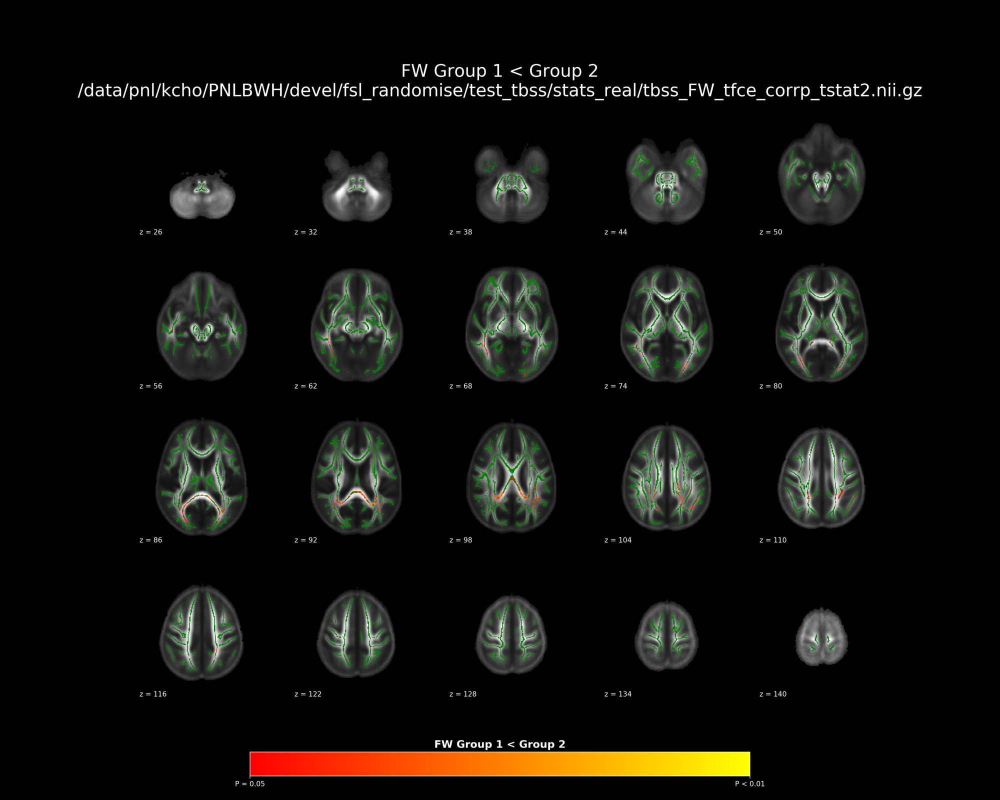
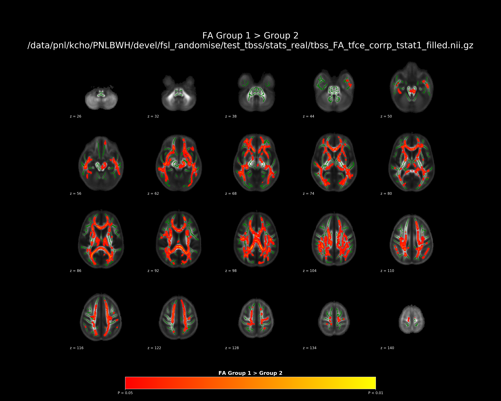

 

[](https://zenodo.org/badge/latestdoi/209407534)


# FSL Randomise related tools

1. Run randomise in parallel
2. Summarize and Visualize Information from FSL Randomise Outputs


Table of Contents
=================

   * [Dependencies](#dependencies)
   * [Installation](#installation)
      * [1. Install prerequisites](#1-install-prerequisites)
         * [i. Check system architecture](#i-check-system-architecture)
         * [ii. Python 3](#ii-python-3)
         * [iii. FSL](#iii-fsl)
         * [iv. ANTs](#iv-ants)
      * [2. Install pipeline](#2-install-pipeline)
      * [3. Configure your environment](#3-configure-your-environment)
   * [Running](#running)
   * [TODO](#TODO)      


# Dependencies

* bsub
* FSL
* numpy
* pandas
* nibabel


# Installation

## 1. Install prerequisites

You may ignore installation instruction for any software module that you have already.

### i. Check system architecture

    uname -a # check if 32 or 64 bit

### ii. Python 3

Download [Miniconda Python 3.6 bash installer](https://docs.conda.io/en/latest/miniconda.html) (32/64-bit based on your environment):
    
    sh Miniconda3-latest-Linux-x86_64.sh -b # -b flag is for license agreement

Activate the conda environment:

    source ~/miniconda3/bin/activate # should introduce '(base)' in front of each line

### iii. FSL

Follow the [instruction](https://fsl.fmrib.ox.ac.uk/fsl/fslwiki/FslInstallation) to download and install FSL.


## 2. Install pipeline

```sh
$ git clone https://github.com/pnlbwh/pnl_randomise && cd pnl_randomise
```
    

## 3. Configure your environment

Make sure the following executables are in your path:

    randomise
    tbss_1_preproc
    

# Running

Upon successful installation, you should be able to see the help message

```sh

$ randomise_parallel_pnl

# and 

$ randomise_summary.py --help  
```


## Scripts
1. `randomise_parallel_pnl` : runs FSL randomise in parallel using bsub
2. `randomise_summary.py` : used to summarize FSL randomise outputs


---


## 1. `randomise_parallel_pnl`

Dispatches `randomise_parallel` splited jobs through `bsub`.


### Dependencies

```
FSL
python 3
nibabel
pandas
numpy
tabulate
pathlib
tempfile
nifti_snapshot 
os
getpass
getpwuid
jinja2
```


### Usage
```sh
# same as fsl randomise
randomise_parallel_pnl -i <4D_input_data> -o <output_rootname> -d design.mat -t design.con -m <mask_image> -n 5000 -T2
```


## 2. `randomise_summary.py`

Summarize outputs from FSL randomise. 
- design matrix
- design contrast
- p-values
- percentage of significant voxels (number of significant voxels / total number of voxels in the skeleton)
- extract values for each subject in the significant cluster
- create html summary


### Dependencies

```
FSL
python 3
nibabel
pandas
numpy
tabulate
Path
tempfile
nifti_snapshot 
jinja2
os
getpass
getpwuid
```


### Usage


#### Simple use

##### If I were you, I wouldn't read all of documentation below. Just try runing below

```sh
# path where tbss_*corrp_tstat*nii.gz
cd /TBSS/STAT/DIR
randomise_summary.py 

# It automatically finds `design.mat` and `design.con` in the current directory,
# along with `*corrp*nii.gz` images when ran without any options.
```


Individual `*corrp*nii.gz` images, `design.mat` and `design.con` in 
different location could be specified with options.

```
randomise_summary.py --contrast design.con --matrix design.mat
randomise_summary.py --input tbss_FA_corrp_tstat1.nii.gz
```


##### Control p-value threshold
The p-value for defining significance could be altered by adding extra option `-t` or `--threshold`

```sh
randomise_summary.py -t 0.99
```

#### More advanced use

##### Extract values for the significant cluster in each subject

It is a common practice to look at correlations between the mean values of each
subject in the significant cluster and their clinical scales.  Simply add `--subject_values` option for this.

```sh
randomise_summary.py --subject_values
```

If your randomise directory does not have the `all_*.nii.gz` (4d merged image), 
specify the directory where the 4d merged images are, with `--merged_img_dir`

```sh
randomise_summary.py --subject_values \
                     --merged_img_dir /DIRECTORY/WITH/all_4D_skeleton.nii.gz
```

##### more options

```sh
randomise_summary.py --sig_only
randomise_summary.py --figure
randomise_summary.py --atlasquery
randomise_summary.py --tbss_fill 
randomise_summary.py --subject_values
randomise_summary.py --skeleton_summary 
randomise_summary.py --skeleton_summary --tbss_all_loc ${tbss_all_out_dir} --html_summary
```

#### What I would use

```sh
randomise_summary.py 
randomise_summary.py \
    --figure \
    --tbss_fill \
    --subject_values \
    --skeleton_summary \
    --tbss_all_loc /TBSS/ALL/DIR \
    --html_summary
google-chrome randomise_summary.html
```


### Example outputs

#### simple run
```sh
randomise_summary.py
```

```
Importing modules
Importing modules complete

--------------------------------------------------------------------------------
* Summarizing information for files below
--------------------------------------------------------------------------------
	/data/pnl/kcho/tbss_example/enigma-tbss/stats/precompute_1_randomise/tbss_FW_tfce_corrp_tstat1.nii.gz
	/data/pnl/kcho/tbss_example/enigma-tbss/stats/precompute_1_randomise/tbss_FW_tfce_corrp_tstat2.nii.gz
	/data/pnl/kcho/tbss_example/enigma-tbss/stats/precompute_1_randomise/tbss_FAt_tfce_corrp_tstat1.nii.gz
	/data/pnl/kcho/tbss_example/enigma-tbss/stats/precompute_1_randomise/tbss_FAt_tfce_corrp_tstat2.nii.gz
	/data/pnl/kcho/tbss_example/enigma-tbss/stats/precompute_1_randomise/tbss_FA_tfce_corrp_tstat1.nii.gz
	/data/pnl/kcho/tbss_example/enigma-tbss/stats/precompute_1_randomise/tbss_FA_tfce_corrp_tstat2.nii.gz

--------------------------------------------------------------------------------
* Matrix summary
--------------------------------------------------------------------------------
Contrast file : design.con
Matrix file : design.mat

total number of data point : 135
Group columns are : col 1, col 2
+---------------+---------+---------+--------------------------------------------------------------------------+
|               | col 1   | col 2   | col 3                                                                    |
|---------------+---------+---------+--------------------------------------------------------------------------|
| mean          | 0.39    | 0.61    | 35.81                                                                    |
| std           | 0.49    | 0.49    | 11.21                                                                    |
| min           | 0.0     | 0.0     | 18.0                                                                     |
| max           | 1.0     | 1.0     | 63.0                                                                     |
| unique values | 0. 1.   | 0. 1.   | 18. 19. 20. 21. 22. 23. 24. 25. 26. 27. 28. 29. 30. 31. 32. 33. 34. 35.  |
|               |         |         |  36. 37. 38. 39. 40. 41. 42. 43. 44. 45. 46. 47. 49. 51. 52. 53. 55. 56. |
|               |         |         |  57. 59. 60. 63.                                                         |
| count         | 53      | 82      | 2  2  3  7  1  4  3  7  3  2  5 11  3  3  4  3  2  6  6  4  3  7  2  2   |
|               |         |         |   2  4  5  2  3  3  1  4  2  2  2  4  2  1  1  2                         |
| column info   | Group 1 | Group 2 | nan                                                                      |
+---------------+---------+---------+--------------------------------------------------------------------------+


--------------------------------------------------------------------------------
* Result summary
--------------------------------------------------------------------------------
+-----------------------------------+-------------+-------------------+--------+------------+----------------+-----------+-------------+--------------+------------------------+----------+-----------+
| file name                         | contrast    | contrast_text     | Test   | Modality   | Significance   |   Sig Max |    Sig Mean |      Sig Std |   % significant voxels |   % left |   % right |
|-----------------------------------+-------------+-------------------+--------+------------+----------------+-----------+-------------+--------------+------------------------+----------+-----------|
| tbss_FA_tfce_corrp_tstat1.nii.gz  | 1. -1.  0.  | Group 1 > Group 2 | t      | FA         | True           |  0.994951 |   0.017583  |   0.00962737 |                   22.4 |     12   |      10.4 |
| tbss_FA_tfce_corrp_tstat2.nii.gz  | -1.  1.  0. | Group 1 < Group 2 | t      | FA         | False          |  0.356494 | nan         | nan          |                  nan   |    nan   |     nan   |
| tbss_FAt_tfce_corrp_tstat1.nii.gz | 1. -1.  0.  | Group 1 > Group 2 | t      | FAt        | True           |  0.991517 |   0.0251597 |   0.0122004  |                    6.1 |      3   |       3   |
| tbss_FAt_tfce_corrp_tstat2.nii.gz | -1.  1.  0. | Group 1 < Group 2 | t      | FAt        | False          |  0.244799 | nan         | nan          |                  nan   |    nan   |     nan   |
| tbss_FW_tfce_corrp_tstat1.nii.gz  | 1. -1.  0.  | Group 1 > Group 2 | t      | FW         | False          |  0.147445 | nan         | nan          |                  nan   |    nan   |     nan   |
| tbss_FW_tfce_corrp_tstat2.nii.gz  | -1.  1.  0. | Group 1 < Group 2 | t      | FW         | True           |  0.977782 |   0.0396292 |   0.00816982 |                    3.9 |      2.2 |       1.7 |
+-----------------------------------+-------------+-------------------+--------+------------+----------------+-----------+-------------+--------------+------------------------+----------+-----------+

```


#### Figure 

```sh
randomise_summary.py --figure
```

</img>
</img>
</img>


#### `tbss_fill` Figure 

```sh
randomise_summary.py --tbss_fill
```

</img>
</img>
</img>


#### All options

```sh
usage: randomise_summary.py [-h] [--directory DIRECTORY]
                            [--input INPUT [INPUT ...]]
                            [--threshold THRESHOLD] [--contrast CONTRAST]
                            [--matrix MATRIX] [--template TEMPLATE]
                            [--subject_values] [--cov_info] [--sig_only]
                            [--f_only] [--merged_img_dir MERGED_IMG_DIR]
                            [--merged_image MERGED_IMAGE] [--atlasquery]
                            [--figure] [--tbss_fill] [--skeleton_summary]
                            [--tbss_all_loc TBSS_ALL_LOC] [--html_summary]

The most simple way to use the script is
  cd stats
  ls
    all_FA_skeleton.nii.gz
    tbss_FA_tfce_corrp_tstat1.nii.gz
    tbss_FA_tfce_corrp_tstat2.nii.gz
    design.mat
    design.con
  randomise_summary.py


optional arguments:
  -h, --help            show this help message and exit
  --directory DIRECTORY, -d DIRECTORY
                        Specify randomise out directory.
  --input INPUT [INPUT ...], -i INPUT [INPUT ...]
                        Specify randomise out corrp files. If this option is
                        given, --directory input is ignored
  --threshold THRESHOLD, -t THRESHOLD
                        Threshold for the significance
  --contrast CONTRAST, -c CONTRAST
                        Contrast file used for the randomise.
  --matrix MATRIX, -m MATRIX
                        Matrix file used for the randomise
  --template TEMPLATE, -template TEMPLATE
                        FA template used (or created) in TBSS
  --subject_values, -s  Print average in the significant cluster for all
                        subjects
  --cov_info, -ci       Print covariate information for each group
  --sig_only, -so       Print only the significant statistics
  --f_only, -fo         Print only the output from f-test
  --merged_img_dir MERGED_IMG_DIR, -merged_image_d MERGED_IMG_DIR
                        Directory that contains merged files
  --merged_image MERGED_IMAGE, -merged_image MERGED_IMAGE
                        Directory that contains merged files
  --atlasquery, -a      Run atlas query on significant corrp files
  --figure, -f          Create figures
  --tbss_fill, -tf      Create figures with tbss_fill outputs
  --skeleton_summary, -ss
                        Create summary from all skeleton and also figures from
                        merged_skeleton_images
  --tbss_all_loc TBSS_ALL_LOC, -tal TBSS_ALL_LOC
                        tbss_all output path
  --html_summary, -hs   Create web summary from the randomise outputs

Kevin Cho Thursday, August 22, 2019
```


### Test using `test_randomise_summary.py`

```sh
test_randomise_summary.py
```

Above script checks for whether 
- the modality from the file name is detected correctly
- the `*corrp*nii.gz` is read properly
- the number of significant voxels are the same as that estimated in FSL
- the mean of significant voxels are almost equal to that estimated in FSL (to 4th decimal point)
- the overlap estimated with the harvard oxford atlas equals that estimated in FSL


# TODO

- Make a option to run `randomise_parallel_pnl` in environments without `bsub`
- Write a complete test for `randomise_summary.py`
- Write up contrast line translation functions for interaction effect
- Add atlas query output to the html summary
