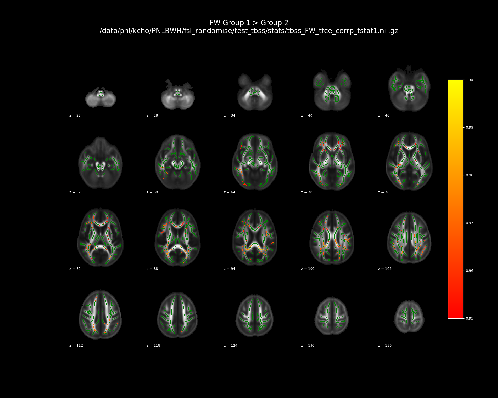

# fsl_randomise

FSL randomise related scripts.


## TODO
- Write a complete test for randomise_summary.py
- Write up contrast line translation functions for interaction effect


## Scripts
- `randomise_summary.py` : used to summarize FSL randomise outputs
- `kcho_randomise_parallel` : runs FSL randomise in parallel using bsub


---


## `kcho_randomise_parallel`
Dispatches `randomise_parallel` splited jobs through `bsub`.


### Dependencies
- FSL


### Usage
```sh
randomise -i <4D_input_data> -o <output_rootname> -d design.mat -t design.con -m <mask_image> -n 5000 -T2
```


---


## `randomise_summary.py`

Summarize outputs from FSL randomise. 
- p-values
- percentage of significant voxels
- design matrix summary
- extract values for each subject in the significant cluster


### Dependencies
- python 3
- nibabel
- pandas
- numpy
- tabulate


### Example output

```
/data/pnl/kcho/PNLBWH/fsl_randomise/test_tbss/stats None None

--------------------------------------------------------------------------------
* Matrix summary
--------------------------------------------------------------------------------
/data/pnl/kcho/PNLBWH/fsl_randomise/test_tbss/stats
/data/pnl/kcho/PNLBWH/fsl_randomise/test_tbss/stats/design.con
/data/pnl/kcho/PNLBWH/fsl_randomise/test_tbss/stats/design.mat
total number of data point : 4
Group columns are : col 0, col 1
+--------+---------+---------+---------+-------------+
|        | col 0   | col 1   | col 2   | col 3       |
|--------+---------+---------+---------+-------------|
| mean   | 0.0     | 1.0     | 0.75    | 26.75       |
| std    | 0.0     | 0.0     | 0.5     | 7.23        |
| min    | 0.0     | 1.0     | 0.0     | 20.0        |
| max    | 0.0     | 1.0     | 1.0     | 37.0        |
| unique | Group 1 | Group 2 | 0. 1.   | 20. 25. 37. |
| count  | 0       | 4       | 1 3     | 1 2 1       |
+--------+---------+---------+---------+-------------+

There are voxels with p value between 0.9495 and 0.05. These numbers are rounded up in FSL to 0.95. Threfore to match to the FSL outputs, changing the threshold to (threshold - 0.00001)

--------------------------------------------------------------------------------
* Values extracted for each subject
--------------------------------------------------------------------------------
-------------------------------------------------------------------------------
tbss_FW_tfce_corrp_tstat1.nii.gz
+-----------+-------------------------------------------------------------------------+---------+---------+---------+---------+
|           |   FW values in the significant cluster tbss_FW_tfce_corrp_tstat1.nii.gz |   col 0 |   col 1 |   col 2 |   col 3 |
|-----------+-------------------------------------------------------------------------+---------+---------+---------+---------|
| subject 1 |                                                               0.0785187 |       0 |       1 |       1 |      25 |
| subject 2 |                                                               0.10789   |       0 |       1 |       1 |      25 |
| subject 3 |                                                               0.123824  |       0 |       1 |       0 |      37 |
| subject 4 |                                                               0.124727  |       0 |       1 |       1 |      20 |
+-----------+-------------------------------------------------------------------------+---------+---------+---------+---------+
/data/pnl/kcho/PNLBWH/fsl_randomise/test_tbss/stats/values_extracted_for_all_subjects.csv is created.


--------------------------------------------------------------------------------
* Result summary
--------------------------------------------------------------------------------
+----------------------------------+-----------------+-------------------+--------+------------+------------+----------------+-----------+-------------+--------------+------------------------+----------+-----------+
| file name                        | contrast        | contrast_text     | Test   | Modality   |   Stat num | Significance   |   Sig Max |    Sig Mean |      Sig Std |   % significant voxels |   % left |   % right |
|----------------------------------+-----------------+-------------------+--------+------------+------------+----------------+-----------+-------------+--------------+------------------------+----------+-----------|
| tbss_FW_tfce_corrp_tstat1.nii.gz | 1. -1.  0.  0.  | Group 1 > Group 2 | t      | FW         |          1 | True           |    0.9886 |   0.0336064 |   0.00899722 |                   22.6 |       22 |      28.4 |
| tbss_FW_tfce_corrp_tstat2.nii.gz | -1.  1.  0.  0. | Group 1 < Group 2 | t      | FW         |          2 | False          |    0.0536 | nan         | nan          |                  nan   |      nan |     nan   |
+----------------------------------+-----------------+-------------------+--------+------------+------------+----------------+-----------+-------------+--------------+------------------------+----------+-----------+


--------------------------------------------------------------------------------
* Atlas query of the significant cluster
--------------------------------------------------------------------------------
+----+----------------------------------+------------------------------------------+---------+----------+----------+----------+
|    | file_name                        | Structure                                | atlas   |        L |        M |        R |
|----+----------------------------------+------------------------------------------+---------+----------+----------+----------|
|  0 | tbss_FW_tfce_corrp_tstat1.nii.gz | Anterior corona radiata                  | Labels  |   3.0888 | nan      |   4.909  |
|  1 | tbss_FW_tfce_corrp_tstat1.nii.gz | Anterior limb of internal capsule        | Labels  |   1.6547 | nan      |   0.3861 |
|  3 | tbss_FW_tfce_corrp_tstat1.nii.gz | Body of corpus callosum                  | Labels  | nan      |   7.4462 | nan      |
|  6 | tbss_FW_tfce_corrp_tstat1.nii.gz | External capsule                         | Labels  |   0.6619 | nan      |   1.048  |
|  9 | tbss_FW_tfce_corrp_tstat1.nii.gz | Genu of corpus callosum                  | Labels  | nan      |   6.1224 | nan      |
| 12 | tbss_FW_tfce_corrp_tstat1.nii.gz | Posterior corona radiata                 | Labels  |   1.8753 | nan      |   2.096  |
| 13 | tbss_FW_tfce_corrp_tstat1.nii.gz | Posterior limb of internal capsule       | Labels  |   0.6619 | nan      |   0.8825 |
| 14 | tbss_FW_tfce_corrp_tstat1.nii.gz | Posterior thalamic radiation             | Labels  |   1.6547 | nan      |   2.813  |
| 15 | tbss_FW_tfce_corrp_tstat1.nii.gz | Retrolenticular part of internal capsule | Labels  | nan      | nan      |   1.3789 |
| 16 | tbss_FW_tfce_corrp_tstat1.nii.gz | Sagittal stratum                         | Labels  | nan      | nan      |   1.5996 |
| 17 | tbss_FW_tfce_corrp_tstat1.nii.gz | Splenium of corpus callosum              | Labels  | nan      |  11.0866 | nan      |
| 18 | tbss_FW_tfce_corrp_tstat1.nii.gz | Superior corona radiata                  | Labels  |   0.1655 | nan      |   0.717  |
| 19 | tbss_FW_tfce_corrp_tstat1.nii.gz | Superior fronto-occipital fasciculus     | Labels  |   0.2206 | nan      | nan      |
| 20 | tbss_FW_tfce_corrp_tstat1.nii.gz | Superior longitudinal fasciculus         | Labels  |   4.6332 | nan      |   2.3718 |
| 22 | tbss_FW_tfce_corrp_tstat1.nii.gz | Tapetum                                  | Labels  |   0.2758 | nan      |   0.2206 |
| 24 | tbss_FW_tfce_corrp_tstat1.nii.gz | Unclassified                             | Labels  | nan      |  42.0298 | nan      |
+----+----------------------------------+------------------------------------------+---------+----------+----------+----------+


```





### Usage


> Simplest use

It automatically finds `design.mat` and `design.con` in the current directory,
along with `*corrp*nii.gz` images when ran without any options.

```sh
cd RANDOMISE/LOCATION/stats
randomise_summary.py
```


> Individual `*corrp*nii.gz`

Also individual `*corrp*nii.gz` images, `design.mat` and `design.con` in 
different location could be specified with options.

```sh
randomise_summary.py -i stats/tbss_corrp_tstat1.nii.gz

# you can also specify design matrices if they have different naming
randomise_summary.py -i stats/tbss_corrp_tstat1.nii.gz \
                     -d stats/this_is_design_file.mat \
                     -c stats/this_is_contrast_file.mat \

```


> Control p-value threshold

The p-value for significance could be altered, if higher threshold is rquired
by adding extra option `-t` or `--threshold`

```sh
randomise_summary.py -t 0.99
```


> Run FSL's atlas query with the significant cluster

FSL's atlas query returns information about the location of the cluster. If
`-a` or `--atlas` option is given, the script will run atlas query on the 
significant cluster and print the summarized output on screen

```sh
randomise_summary.py -a
```


> Extract values for the significant cluster in each subject

It is a common practice to look at the correlation between the values of each
subject in the significant cluster and their clinical scales.  Simply add `--subject_values` option for this.

```sh
randomise_summary.py --subject_values
```

If your randomise directory does not have the `all_*.nii.gz` (4d merged image), 
specify the directory where the 4d merged images are, with `--merged_img_dir`

```sh
randomise_summary.py --subject_values \
                     --merged_img_dir /DIRECTORY/WITH/all_4D_skeleton.nii.gz
```


> Create png file -- **under development : link kcho_figure.py**

```sh
randomise_summary.py --figure
```


> All options

```sh
usage: randomise_summary.py [-h] [--directory DIRECTORY]
                            [--input INPUT [INPUT ...]]
                            [--threshold THRESHOLD] [--contrast CONTRAST]
                            [--matrix MATRIX] [--subject_values]
                            [--merged_img_dir MERGED_IMG_DIR] [--atlasquery]
                            [--figure]

        randomise_summary.py --dir /example/randomise/output/dir/
        

optional arguments:
  -h, --help            show this help message and exit
  --directory DIRECTORY, -d DIRECTORY
                        Specify randomise out dir. This this option is given,
                        design.mat and design.con within the directory are
                        read by default.
  --input INPUT [INPUT ...], -i INPUT [INPUT ...]
                        Specify randomise out corrp files. If this option is
                        given, --directory input is ignored
  --threshold THRESHOLD, -t THRESHOLD
                        Threshold for the significance
  --contrast CONTRAST, -c CONTRAST
                        Contrast file used for the randomise.
  --matrix MATRIX, -m MATRIX
                        Matrix file used for the randomise
  --subject_values, -s  Print average in the significant cluster for all
                        subjects
  --merged_img_dir MERGED_IMG_DIR, -p MERGED_IMG_DIR
                        Directory that contains merged files
  --atlasquery, -a      Run atlas query on significant corrp files
  --figure, -f          Create figures

Kevin Cho Thursday, August 22, 2019
```


### Test using `test_randomise_summary.py`

```sh
python test_randomise_summary.py
```

Above script checks for whether 
- the modality from the file name is detected correctly
- the `*corrp*nii.gz` is read properly
- the number of significant voxels are the same as that estimated in FSL
- the mean of significant voxels are almost equal to that estimated in FSL (to 4th decimal point)
- the overlap estimated with the harvard oxford atlas equals that estimated in FSL
